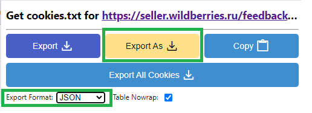

# инструмент для автоматизации ответов на отзывы на маркетплейсах

## поддерживаемые маркетплейсы

* wildberries
* ozon
* avito + чаты авито

## использование
```
usage: main.py [-h] [--wildberries | --ozon | --avito | --avitochat] [--csv | --sqlite | --void] [--probabilistic | --fromlist] [--file FILE] [--shortsleep]   
               [--maxanswers] [--fromstar] [--version] [--timeleft] [--companyid] [--cookies] [--apikey] [--everyminutes] [--brand] [--new]
               [--old] [--skipcanceled] [--skipnormal]

программа для автоматизации отзывов на маркетплейсах

options:
  -h, --help           show this help message and exit
  --wildberries, -wb   режим работы с wildberries
  --ozon, -oz          режим работы с ozon
  --avito, -av         режим работы с avito
  --avitochat, -avc    режим работы с чатами авито
  --csv                сохранять отзывы и ответы в csv файл
  --sqlite             сохранять отзывы и ответы в db файл. Может быть открыт, например с помощью sqlitebrowser
  --void               не сохранять отзывы и ответы
  --probabilistic      составление отзыва из частей.
  --fromlist           выбирает отзывы из списка.
  --file FILE          файл для генерации ответов
  --shortsleep , -ss   пауза между ответами.
  --maxanswers , -ma   максимальное количество ответов
  --fromstar , -fs     оценка с которой начинать обработку.
  --version            показать текущую версию
  --timeleft           вывести оставшееся время лицензии в днях
  --companyid          id компании ozon
  --cookies            путь до cookies
  --apikey             api токен
  --everyminutes       пауза между запусками в минутах
  --brand              название бренда для подстановки в $brand$
  --new                сообщения с момента получения которых прошло меньше часов не будут обрабатываться. Только для чатов авито
  --old                сообщения с момента получения которых прошло больше часов не будут обрабатываться. Только для чатов авито
  --skipcanceled       не отвечать на отмененные отзывы из озона
  --skipnormal         не отвечать на не отмененные отзывы из озона
```
Запустить двойным кликом нужный файл: wildberries.cmd или ozon.cmd. Можно создать другие файлы с другими настройками запуска.

## генерация ответов

файл шаблонов ответов передается через параметр `--file <путь до файла>`

### составление по шаблону

для использования этого режима передайте параметр `--probabilistic`

Шаблоны задаются в json файле. Пример в settings/prob.json

Для составления ответов бот использует шаблоны из файлов. Ниже описан алгоритм генерации ответов.

```
Если оценка больше или равна 4, то
в 30% случаев к ответу будет добавлен один из шаблонов раздела с соответствующей оценкой.

В остальных 70% случаях, если комментарий не пустой, то к ответу добавится один из шаблонов раздела 'gratitude'. Если пустой, то добавится один из шаблонов раздела 'gratitude no comment'.

Дальше с вероятностью 0.5 совместно добавляются шаблоны из разделов 'main' и 'recommendations'.

Если оценка равна 3 и у отзыва есть комментарий, то к ответу добавляется шаблон из раздела '3', если комментария нет, то добавляется шаблон из раздела '3 no comment'.

Если оценка меньше 3 в 30% случаях добавляется шаблон из раздела с соответствующей оценкой. В остальных случаях шаблон выбирается из раздела 'apologies'. Если отзыв не пустой, то к нему также добавляется шаблон из раздела 'examination'.

В конце ко всем ответам добавляется шаблон из раздела 'goodbye'.
```

### выбор из списка

для использования этого режима передайте параметр `--fromlist`

В json файле задаются списки для отмененных и не отмененных отзывов с разными оценками. Пример в settings/list.json

Программа будет выбирать случайный отзыв из подходящего списка и использовать его.

### подстановка значений.

Чтобы персонализировать ответы, можно добавить обращение к покупателю по имени. Для этого в шаблонах где предполагается имя пользователя пишите `$name$`. В шаблонах **нужно оставить варианты ответа без обращения по имени**, т.к. программа не будет подставлять имя в случае если оно не распознано как имя (пользователи могут скрывать его или использовать ники).

Также можно использовать `$brand$`, туда будет подставлено значение переданное через `--brand <назвние бренда>`. Это можно использовать, чтобы не создавать для каждой компании свой файл с шаблонами.

## состав программы

* main.exe - основная программа.
* ozon.cmd - скрипт для запуска программы в режиме работы с ozon. Можно переименовывать и создавать свои.
* wildberries.cmd - скрипт для запуска программы в режиме работы с wildberries. Можно переименовывать и создавать свои.
* README.pdf - описание программы.
* responderbot.cer - сертификат, с помощью которого подписана программа. Если на программу ругается антивирус, то можно попробовать добавить этот сертификат в доверенные или просто добавить программу в доверенные.
* settings/prob.json - шаблоны ответов для вероятностного режима.
* settings/list.json - шаблоны ответов для режима выбора из списка.
* settings/settings.json - файл с настройками программы.

## настройка

в файле settings/settings.json задаются:
* database - путь до файла, куда будут сохранены ответы
* email
* key - ключ. Без него программа будет работать в демонстрационном режиме. Ответы не будут сохранены на маркетплейсе.

### настройка отзывов на которые не надо отвечать

* В файлах с ответами есть список stop_words. Если его заполнить программа не будет отвечать на отзывы, содержащие слова из этого списка.

* Можно задать параметр `--fromstar n`, тогда программа будет отвечать на отзывы с оценкой большей или равной  `n`
* При параметре `--skipnormal` программа отвечает только на отмененные отзывы. Параметр работает только для озона.
* При параметре `--skipcanceled` программа отвечает только на обычные отзывы, пропуская отмененные. Параметр работает только для озона.

### настройка расписания

С помощью параметра `--everyminutes n` можно настроить запуск программы по расписанию. После того как программа ответит на отзывы она будет ждать `n` минут до следующего запуска.

### сохранение ответов

Программа может сохранять отзывы и ответы в csv файл или в файл базы данных sqlite. Для этого нужно выставить соответственно `--csv` или `sqlite`. При выставлении `--void` ответы сохранятся не будут.

### авторизация

#### ozon
Для авторизации на озон нужно зайти в личный кабинет через chrome. Закрыть chrome, после чего запустить программу в режиме работы с озон. После чего можно продолжать использовать chrome.

Если такой способ не работает нужно будет выгрузить cookie файл в ручную с помощью расширения как это описано ниже.

* авторизоваться на озоне через chrome.
* установить [расширение](https://chromewebstore.google.com/detail/get-cookiestxt-locally/cclelndahbckbenkjhflpdbgdldlbecc)
* перейти на сайт маркетплейса. Нажать на расширение, выбрать `export format json`, нажать `Export as` и сохранить в удобное место, например в папку settings с настройками программы
* задать параметр передающий cookies `--cookies settings/seller.ozon.ru_cookies.json`
* для ozon выставить параметр задающий id компании `--companyid <id>`



#### wildberries
авторизация на wildberries производится посредством api ключа. Нужно создать api ключ с доступом к получению и редактированию отзывов и передать его через параметр `--apikey`

#### avito
задать параметры
* `--companyid` Client_id
* `--apikey` Client_secret


### файлы запуска
Файлы запуска имеют расширение .cmd и содержат скрипт запуска программы вида "main.exe <параметр 1> <параметр 2> ..."

Для более удобного чтения параметры можно разносить на разные строки. Для этого в конце строки ставиться символ "^", который склеивает несколько строк в одну.

Последней строкой скрипта можно выставить команду "pause", которая предотвратит закрытие окна при завершении работы. В строке перед "pause" не надо ставить символ "^", т.к. команда "pause" не является параметром программы и должна находиться на следующей строке.

## просмотр ответов

При сохранении в csv результаты можно импортировать в excel через вставку из текстового файла.

При использовании режима sqlite результаты сохраняются в специальный файл. Он может быть открыт, например, через [sqlitebrowser](https://sqlitebrowser.org/).

При сохранении в sqlite дата сохраняется в виде timestamp. Чтобы отобразить в привычном формате нужно правой кнопкой мыши нажать на столбец 'date', далее 'edit display format' и вместо 'default' выбрать 'Unix epoch to local time'

## Обновление

При запуске программа может предложить загрузить обновление. Новая версия будет скачана, а старая будет переименована в main_<версия>.exe. Также будет создан текстовый файл с описанием обновления.

При удачном обновлении старую версию можно удалить или оставить для возможности отката.

История версий доступна по [адресу](https://github.com/G0-G4/ResponseBot/releases)