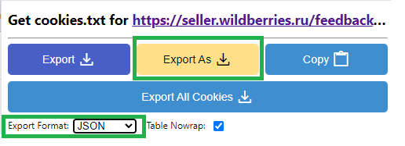

# Выгрузка куки файла

Т.к. озон не предоставляет официального апи, [хотя обещает](https://dev.ozon.ru/community/446-Rabota-s-otzyvami-cherez-API?__rr=1)
Для авторизации используются куки файл, которые нужно передать через параметр `--cookies`

## выгрузка

1. установите [расширение](https://chromewebstore.google.com/detail/get-cookiestxt-locally/cclelndahbckbenkjhflpdbgdldlbecc)
2. зайдите на сайт озона и авторизуйтесь
3. активируйте расширение и выгрузите в формате json

